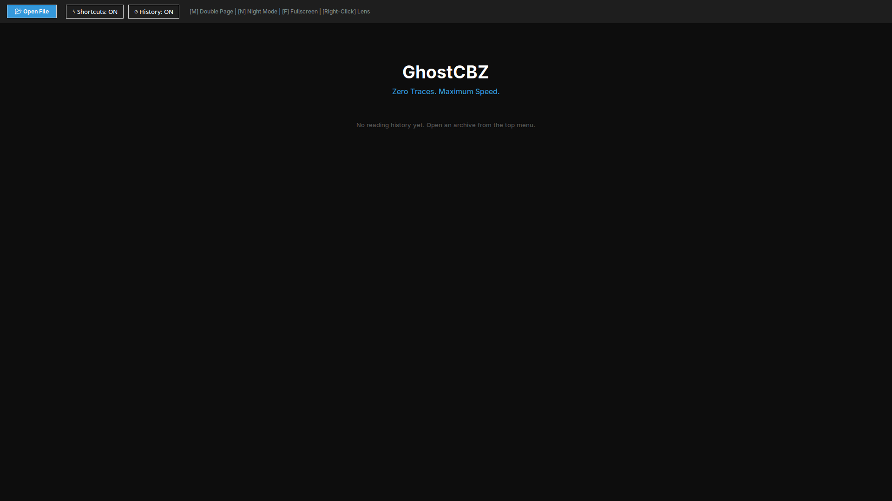

# GhostCBZ 👻

A blazingly fast, distraction-free, and privacy-focused comic book reader (`.cbz`, `.zip`) built with Python and Tkinter. Engineered to operate entirely in-memory with zero temporary disk writes.

---

## 📸 Screenshots
<p align="center">
  
</p>

> *Place your app screenshot in the root directory named `screenshot.png` to display it above.*

---

## ⚡ Engineering Philosophy (Why GhostCBZ?)
Traditional comic readers extract archive files into the operating system's temporary directory (`/tmp` or `%TEMP%`). This design causes excessive Disk I/O, degrades SSD health over time, and leaves unencrypted files behind if the application crashes.

**GhostCBZ operates 100% in-memory:**
- **In-Memory Decompression:** Reads `.cbz` and `.zip` archives directly into RAM using Python's `io.BytesIO`.
- **Zero Disk Footprint:** No files are extracted to your drive during reading.
- **Hardware-Friendly:** Eliminates storage read/write latency for instantaneous page turns.
- **True Incognito Mode:** Toggling the history switch immediately erases `reader_history.json` from disk and volatile memory.
- **Air-Gapped & Secure:** Contains zero networking sockets, tracking, or telemetry.

---

## ✨ Features
- **In-Memory Rendering:** Zero temp files created on your disk.
- **Dynamic Dual-Page Mode:** On-the-fly image concatenation for seamless Manga spreads (`M` key).
- **High-Contrast Night Mode:** Inverts image colors on the fly for night-time reading (`N` key).
- **Interactive Lens Magnifier:** Inspect small text or fine art panels by holding `Right Click`.
- **UI Toggles:** Instantly enable/disable hotkeys or reading history directly from the top bar.
- **Resume Dashboard:** Quick-access list to resume reading recently opened volumes.

---

## 🎮 Shortcuts & Controls

| Action | Shortcut / Mouse Gesture |
| :--- | :--- |
| **Next Page** | `Right Arrow`, `D`, `Space`, or `Click Right Half` |
| **Previous Page** | `Left Arrow`, `A`, or `Click Left Half` |
| **Dual-Page Spread** | `M` |
| **Inverted Night Mode** | `N` |
| **Magnifier Loupe** | `Right Click` (Hold & Drag over image) |
| **Toggle Fullscreen** | `F` or `F11` |
| **Exit Fullscreen** | `ESC` |
| **Toggle Shortcuts** | UI Button (`⚡ Shortcuts: ON/OFF`) |
| **Toggle History** | UI Button (`🕒 History: ON/OFF`) |

---

## 🚀 How to Run the Pre-Built AppImage

If you downloaded the pre-compiled standalone binary from Releases:

1. Download `GhostCBZ-x86_64.AppImage` from the **Releases** tab.
2. Grant executable permission:
   ```bash
   chmod +x GhostCBZ-x86_64.AppImage
